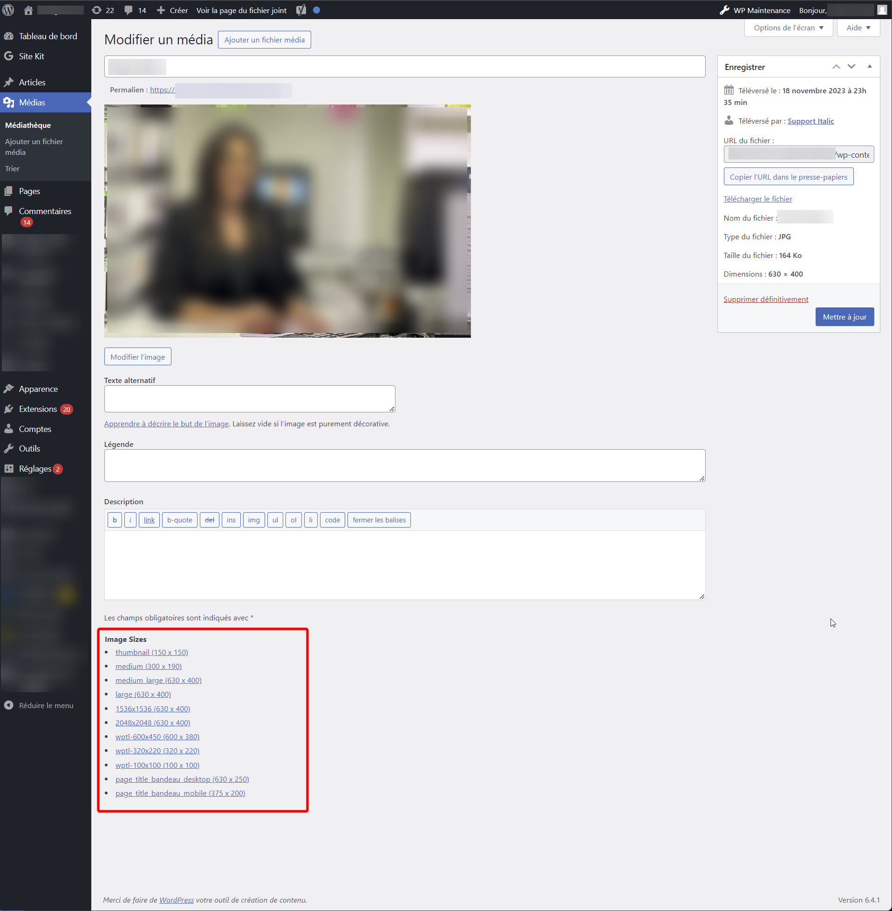

# Italic WP Image Sizes Links

A WordPress plugin to display links to all available image sizes on the image edit page.

# Description

**Have you ever needed to quickly find the link to a specific imgage size?**

This plugin supports WordPress' **default image sizes** (thumbnail, medium, large) as well as any **custom image size** you may add to your site, using the native [add_image_size](https://developer.wordpress.org/reference/functions/add_image_size/) function or a third-party plugin such as [Simple Image Sizes](https://fr.wordpress.org/plugins/simple-image-sizes/).

Simply download and activate, then go you the Media Library and click any image: the links will appear at the bottom of the page.

**Note: this is an admin plugin, it does not add anything to your theme or to public pages.**

# Screenshot

